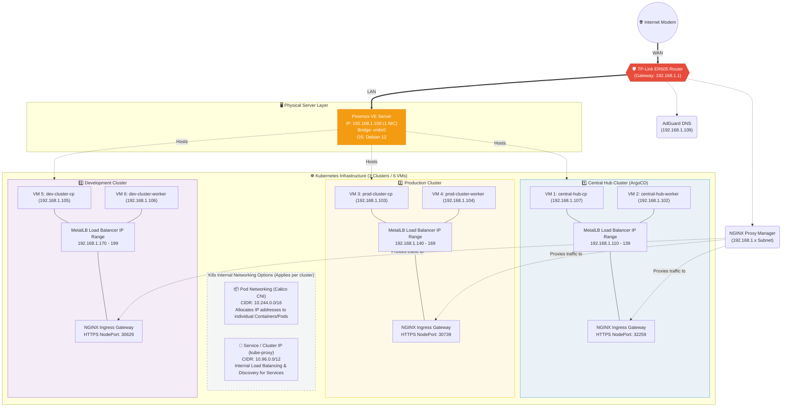

# Complete Multi-Cluster Network Architecture

This document is the single source of truth for all networking across the home lab infrastructure.

---

## Physical Network

| Component | Subnet | IP Address | Role |
|---|---|---|---|
| TP-Link ER605 Router | 192.168.1.x | 192.168.1.1 | Default Gateway |
| Windows PC (Developer) | 192.168.1.x | DHCP / Static | Workstation / WSL |
| AdGuard DNS (LXC) | 192.168.1.x | 192.168.1.109 | DNS Resolver |
| NGINX Proxy Manager | 192.168.1.x | TBD | Tier-1 Reverse Proxy |
| Proxmox VE 9 Host | 192.168.1.x | 192.168.1.100 (Bridge: vmbr0) | Hypervisor |

---

## VM Node IPs (Static - Terraform Provisioned)

| Node | Cluster | Role | IP Address |
|---|---|---|---|
| central-hub-cp | central-hub | Control Plane | 192.168.1.107 |
| central-hub-worker | central-hub | Worker | 192.168.1.102 |
| prod-cluster-cp | prod-cluster | Control Plane | 192.168.1.103 |
| prod-cluster-worker | prod-cluster | Worker | 192.168.1.104 |
| dev-cluster-cp | dev-cluster | Control Plane | 192.168.1.105 |
| dev-cluster-worker | dev-cluster | Worker | 192.168.1.106 |

**Reserved Range:** 192.168.1.100 - 192.168.1.109 (VM Static IPs)

---

## Kubernetes Internal Networks

### Pod Network (Calico CNI)
| Parameter | Value |
|---|---|
| Pod CIDR | 10.244.0.0/16 |
| CNI Plugin | Calico (Tigera Operator) |
| IPAM | Calico Block Affinity |

### Service Network (kube-proxy)
| Parameter | Value |
|---|---|
| Service CIDR | 10.96.0.0/12 (default) |
| Service Range | 10.96.0.1 - 10.111.255.254 |
| DNS (CoreDNS) | 10.96.0.10 |

---

## MetalLB L2 Address Pools

| Cluster | Pool Name | IP Range | Total IPs |
|---|---|---|---|
| central-hub | default-pool | 192.168.1.110 - 192.168.1.139 | 30 |
| prod-cluster | default-pool | 192.168.1.140 - 192.168.1.169 | 30 |
| dev-cluster | default-pool | 192.168.1.170 - 192.168.1.199 | 30 |

> Note: While MetalLB L2 virtual IPs are now on the same `192.168.1.x` subnet as the router and nodes, we still utilize NPM + NodePorts for centralized Domain/TLS proxying.

---

## NGINX Ingress Controller (Per Cluster)

| Cluster | ClusterIP | MetalLB External IP | HTTP NodePort | HTTPS NodePort |
|---|---|---|---|---|
| central-hub | 10.111.249.26 | 192.168.1.110 | 31190 | 32259 |
| prod-cluster | 10.104.184.73 | 192.168.1.140 | 32498 | 30739 |
| dev-cluster | 10.103.153.116 | 192.168.1.170 | 30277 | 30629 |

---

## Cert-Manager

| Parameter | Value |
|---|---|
| Namespace | cert-manager |
| ClusterIssuer Name | selfsigned-issuer |
| Issuer Type | SelfSigned |
| TLS Secret (ArgoCD) | argocd-tls-certificate |

---

## ArgoCD (Central Hub Only)

| Parameter | Value |
|---|---|
| Namespace | argocd |
| Version | v3.3.6 |
| Ingress Host | argocd.local |
| Backend Protocol | HTTPS (port 443) |
| Admin Username | admin |
| Admin Password | lw6QFkNi9IbEdXAK |

---

## NPM Reverse Proxy Mappings

| Domain | NPM Target (Physical IP:NodePort) | Cluster |
|---|---|---|
| argocd.local | https://192.168.1.107:32259 | central-hub |
| prod.local | https://192.168.1.103:30739 | prod-cluster |
| dev.local | https://192.168.1.105:30629 | dev-cluster |

---

## DNS Rewrites (AdGuard)

| Domain | Answer IP | Purpose |
|---|---|---|
| central-hub-cp.local | 192.168.1.107 | VM Node |
| central-hub-worker.local | 192.168.1.102 | VM Node |
| prod-cluster-cp.local | 192.168.1.103 | VM Node |
| prod-cluster-worker.local | 192.168.1.104 | VM Node |
| dev-cluster-cp.local | 192.168.1.105 | VM Node |
| dev-cluster-worker.local | 192.168.1.106 | VM Node |
| argocd.local | NPM IP (TBD) | ArgoCD UI |

---

## Traffic Flow Diagram

